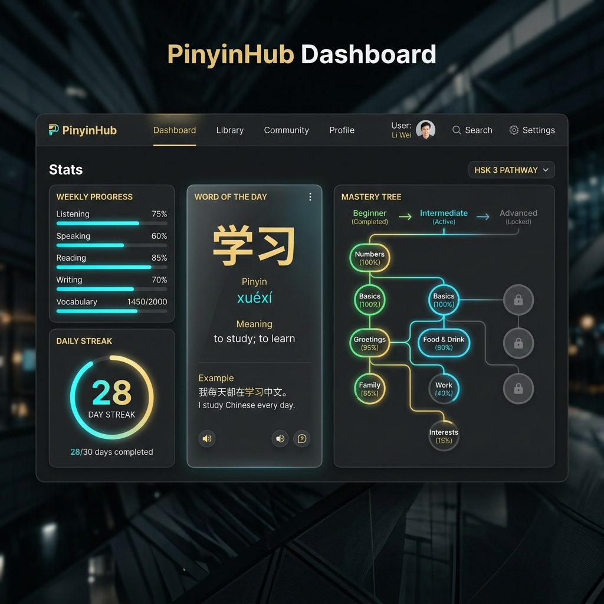
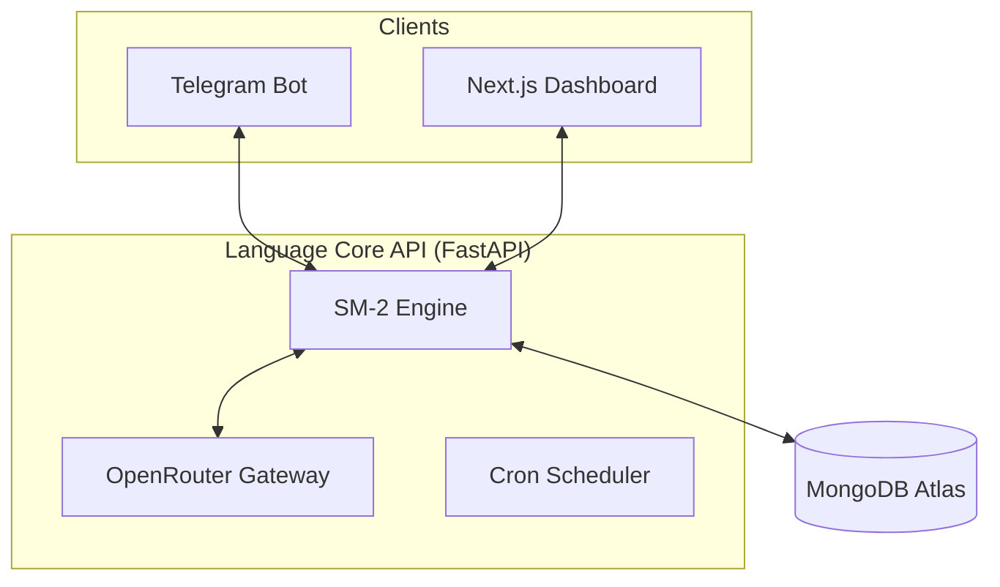
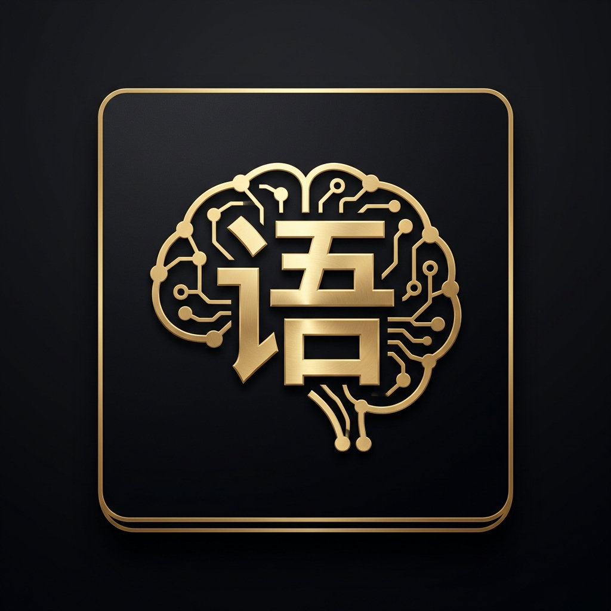

<div align="center">
  
  
  <br />
  
  <h1>语言核心 // Language Core Agent</h1>
  
  <p align="center">
    <b>A 730-Day Autonomous HSK 1-4 Mastery Agent.</b><br />
    Leveraging Claude 3.5 Sonnet for pedagogical expertise and Gemini 1.5 Flash for high-velocity evaluation.
  </p>
  
  <p align="center">
    <a href="#-features">Features</a> •
    <a href="#-architecture">Architecture</a> •
    <a href="#-getting-started">Getting Started</a> •
    <a href="#-deployment">Deployment</a>
  </p>
  
  <div align="center">
    
    
    
  </div>
</div>

---

## 💎 The Vision

Modern language learning is often fragmented. **Language Core Agent** is designed as a persistent, autonomous tutor that lives where you communicate. Over a **730-day journey**, it guides you from zero to HSK 4 mastery using professional-grade spaced repetition and LLM-driven personalized feedback.

<div align="center">
  
  <p><i>The Language Core Dashboard — A premium interface for your linguistic progress.</i></p>
</div>

---

## ✨ Features

- 🤖 **Pedagogical AI**: Daily lessons generated by **Claude 3.5 Sonnet**, focusing on etymology, stroke order, and context.
- ⚡ **Instant Evaluation**: Your practice sentences are evaluated in real-time by **Gemini 1.5 Flash**, checking for grammar, tone, and HSK level appropriateness.
- 🧠 **Deep SRS Integration**: A custom SM-2 algorithm implementation that manages vocabulary state across a multi-year horizon.
- 📱 **Telegram First**: No new apps to download. Your tutor lives in your chat app, pushing lessons at 08:00 and quizzes at 20:00.
- 📊 **Executive Dashboard**: A Next.js 14 web interface featuring:
  - **Mastery Tree**: Visualizing your vocabulary connections.
  - **SRS Telemetry**: Real-time tracking of review counts and ease factors.
  - **Parallax Aesthetics**: A luxury design system using OKLCH color spaces.

---

## 🏗️ Architecture



---

## 🚀 Getting Started

### 1. Requirements
- **Python 3.12+** (Standard distribution recommended)
- **Node.js 18+**
- **MongoDB Atlas** cluster

### 2. Installation
```bash
# Clone the repository
git clone https://github.com/Harshtech1/-Language-Core-Agent.git
cd -Language-Core-Agent

# Install Backend Dependencies
py -3.12 -m pip install -r api/requirements.txt

# Install Frontend Dependencies
npm install
```

### 3. Environment Setup
Configure your `.env` based on `.env.example`:
- `OPENROUTER_API_KEY`: For Claude and Gemini access.
- `TELEGRAM_BOT_TOKEN`: From @BotFather.
- `MONGODB_URI`: Your Atlas connection string.

---

## 📡 API Reference

| Endpoint | Method | Description |
|----------|--------|-------------|
| `/vocab/today` | GET | Retrieve today's scheduled HSK word |
| `/stats/overview` | GET | Get streak and mastery telemetry |
| `/cron/daily-word` | POST | Manually trigger morning lesson push |
| `/webhook/telegram`| POST | Telegram Bot update handler |

---

## 🛡️ License
Distributed under the **MIT License**. See `LICENSE.md` for more information.

<div align="center">
  <br />
  
  <p>Built with ❤️ for lifelong learners.</p>
</div>